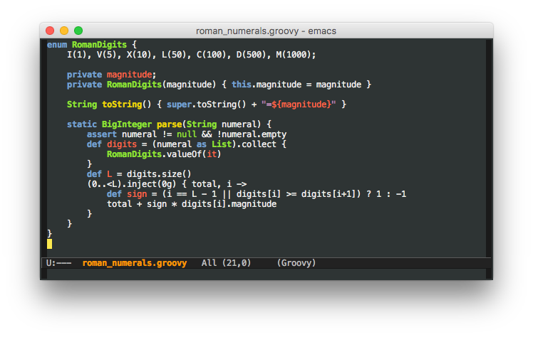

# Emacs Modes for Groovy and Grails

[](https://www.gnu.org/licenses/gpl-3.0.txt)
[](https://melpa.org/#/groovy-mode)
[](https://stable.melpa.org/#/groovy-mode)

This repository contains Emacs modes for Groovy and Grails. The major
features are syntax highlighting with `groovy-mode`, REPL integration
with `run-groovy` and Grails project navigation with `grails-mode`.

## Installation

These modes should work with Emacs 23, but we recommend Emacs 24+.

These packages are available on [MELPA](http://melpa.org/). To use
rolling releases:

``` emacs-lisp
(require 'package)
(add-to-list 'package-archives
             '("melpa" . "https://melpa.org/packages/") t)
(package-initialize)
```

Alternatively, if you just want stable releases:

``` emacs-lisp
(require 'package)
(add-to-list 'package-archives
             '("melpa-stable" . "https://stable.melpa.org/packages/") t)
(package-initialize)
```

## cc-mode derived mode

The default version of `groovy-mode` is derived from `java-mode`,
inspired by Dylan R.E. Moonfire's C# mode.

This version of `groovy-mode` is configured by overriding `cc-mode`
settings, such as `c-basic-offset`.

## Standalone mode

A
[standalone major mode](https://github.com/Groovy-Emacs-Modes/groovy-emacs-modes/tree/standalone_mode) is
also available. This provides more robust highlighting and
indentation, plus niceties like string interpolation highlighting.



The plan is to make this mode the offical `groovy-mode`, so please
give feedback!

You can configure the standalone `groovy-mode` with `M-x customize RET
groovy-mode RET`.

